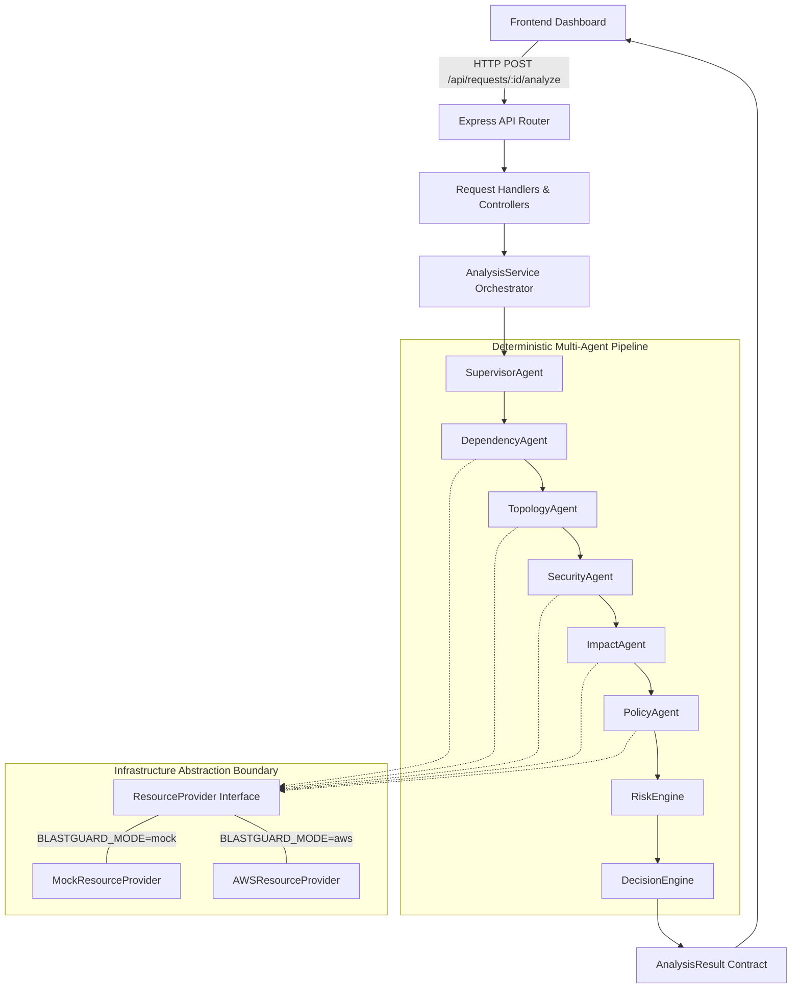
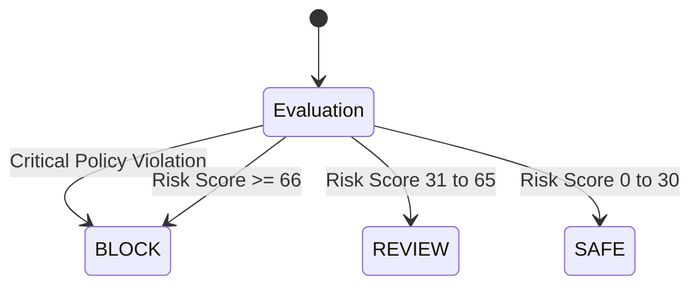

# BlastGuard System Architecture

> **Core statement**: *"Before you change production, know what will break."*

BlastGuard is an enterprise infrastructure safety gate for Amazon Web Services (AWS). It deterministically simulates, discovers, audits, and assesses the blast radius, security implications, policy violations, and risk score of proposed infrastructure modifications (e.g. `DELETE subnet-07`) before changes reach production environments.

---

## 1. End-to-End Analysis Pipeline

BlastGuard enforces a strict, unidirectional architectural hierarchy:

$$\mathbf{Frontend} \longrightarrow \mathbf{API} \longrightarrow \mathbf{Analysis\ Orchestrator} \longrightarrow \mathbf{Resource\ Provider} \longrightarrow \mathbf{Dependency} \longrightarrow \mathbf{Topology} \longrightarrow \mathbf{Security} \longrightarrow \mathbf{Impact} \longrightarrow \mathbf{Policy} \longrightarrow \mathbf{Risk\ Engine} \longrightarrow \mathbf{Decision\ Engine}$$



---

## 2. Dual-Mode Infrastructure Provider System

BlastGuard completely decouples analysis logic from infrastructure data sources via the `ResourceProvider` interface:

```typescript
export interface ResourceProvider {
  getResource(resourceId: string): Promise<Resource | null>;
  listResources(filter?: ResourceFilter): Promise<Resource[]>;
  getDependencies(resourceId: string): Promise<Dependency[]>;
  getTopology(): Promise<ImpactGraph>;
}
```

### Boundary Isolation Principle
**Analysis engines, agents, and API routes never contain `if (mode === 'aws')` conditionals.** All mode resolution occurs strictly at the provider factory boundary (`src/providers/index.ts`).

### Mode 1: Deterministic Mock Mode (`BLASTGUARD_MODE=mock`)
- Default mode for local development, CI/CD, and regression verification.
- Houses a deterministic topology of 20 realistic AWS resources modeling a financial payment processing subsystem.
- Serves as the benchmark environment guaranteeing the critical demo proof:
  `DELETE subnet-07` $\rightarrow$ `riskScore=87`, `severity=CRITICAL`, `decision=BLOCK`, `affectedResources=11`, `criticalServices=3`, `externalDependencies=2`.

### Mode 2: Live Read-Only AWS Mode (`BLASTGUARD_MODE=aws`)
- Uses official AWS SDK v3 clients:
  - `@aws-sdk/client-ec2`: VPCs, Subnets, EC2 Instances, Security Groups
  - `@aws-sdk/client-ecs`: Clusters, Services, Task Definitions
  - `@aws-sdk/client-rds`: DB Instances, Subnet Groups
  - `@aws-sdk/client-lambda`: Serverless Functions, VPC Configurations
  - `@aws-sdk/client-s3`: S3 Buckets
  - `@aws-sdk/client-iam`: IAM Roles & Instance Profiles
  - `@aws-sdk/client-elastic-load-balancing-v2`: Application Load Balancers, Target Groups
- In-memory per-analysis caching (TTL 60s) avoids repeated API requests and prevents rate limits.
- Automatically normalizes AWS SDK payloads into BlastGuard's standardized `Resource` and `Dependency` contracts.

---

## 3. Strict Read-Only Safety Assurance

BlastGuard is a **safety gate**, NEVER an execution engine or deployment tool.
- The `AWSResourceProvider` implements **only** discovery and query APIs (`Describe*`, `List*`, `Get*`).
- Mutating operations (`Delete*`, `Terminate*`, `Create*`, `Update*`, `Modify*`, `Put*`) are **forbidden and absent** from the codebase.
- Verified by automated unit tests inspecting provider prototypes.

---

## 4. Multi-Agent Pipeline & Responsibilities

The analysis pipeline is coordinated by `SupervisorAgent` with zero AI hallucination:

| Agent / Engine | Class | Function |
|---|---|---|
| **Supervisor Agent** | `SupervisorAgent` | Orchestrates the end-to-end deterministic lifecycle and structured logging. |
| **Dependency Agent** | `DependencyAgent` | Discovers direct and indirect dependencies via cycle-safe BFS graph traversal. |
| **Topology Agent** | `TopologyAgent` | Generates graph topology `{ nodes, edges }` for visualization. |
| **Security Agent** | `SecurityAgent` | Evaluates 8 security rules (data boundary, ENI isolation, public ingress). |
| **Impact Agent** | `ImpactAgent` | Computes quantitative metrics (direct/indirect impact, critical services, external nodes). |
| **Policy Agent** | `PolicyAgent` | Evaluates compliance guardrails (POLICY-001 through POLICY-004). |
| **Risk Engine** | `RiskEngine` | Calculates normalized 0–100 risk score and attribution breakdown. |
| **Decision Engine** | `DecisionEngine` | Enforces definitive `SAFE` / `REVIEW` / `BLOCK` verdicts. |

---

## 5. Deterministic Risk Engine & Decision Matrix

### Risk Formula (Normalized 0–100)
$$\text{RiskScore} = \text{DependencyRisk} + \text{CriticalityRisk} + \text{SecurityRisk} + \text{PolicyRisk} + \text{EnvironmentRisk}$$

1. **Dependency Risk (0–25 pts)**:
   - Scale of affected resources ($\ge 10 \rightarrow 15\text{ pts}$, $\ge 5 \rightarrow 10\text{ pts}$, else $5\text{ pts}$).
   - External dependencies ($5\text{ pts}$ each, max $10\text{ pts}$).
2. **Criticality Risk (0–25 pts)**:
   - Target resource criticality (`CRITICAL` = $10\text{ pts}$, `HIGH` = $5\text{ pts}$).
   - Downstream critical compute services (`payment-api`, `payment-worker`, `payment-notifier` at $5\text{ pts}$ each, max $15\text{ pts}$).
3. **Security Risk (0–20 pts)**:
   - `CRITICAL` = $15\text{ pts}$, `HIGH` = $10\text{ pts}$, `MEDIUM` = $5\text{ pts}$.
4. **Policy Risk (0–20 pts)**:
   - `CRITICAL` violation = $5\text{ pts}$ each; `HIGH` violation = $2.5\text{ pts}$ each.
5. **Environment Risk (0–10 pts)**:
   - `PRODUCTION` = $7\text{ pts}$, `STAGING` = $4\text{ pts}$, `DEV` = $2\text{ pts}$.

### Decision Gatekeeper


---

## 6. Security, Credentials & Error Sanitization

1. **Zero Secret Storage**: No AWS keys, secrets, or passwords exist in the codebase. Uses standard AWS SDK Default Credential Provider Chain (environment variables, EC2 instance metadata, ECS task roles).
2. **Sanitized Error Handling**: AWS SDK errors (`CredentialsProviderError`, `AccessDeniedException`, `TimeoutError`, `ServiceUnavailable`) are intercepted by `handleAWSError` and mapped to clean HTTP responses (`401`, `403`, `504`, `503`) without leaking stack traces or internal account IDs.
3. **Structured Observability**: Structured JSON logs are emitted for:
   - `ANALYSIS_STARTED`
   - `RESOURCE_DISCOVERY_COMPLETED`
   - `DEPENDENCY_ANALYSIS_COMPLETED`
   - `ANALYSIS_COMPLETED` (includes `requestId`, `resourceId`, `riskScore`, `decision`)
   - `ANALYSIS_FAILED`
